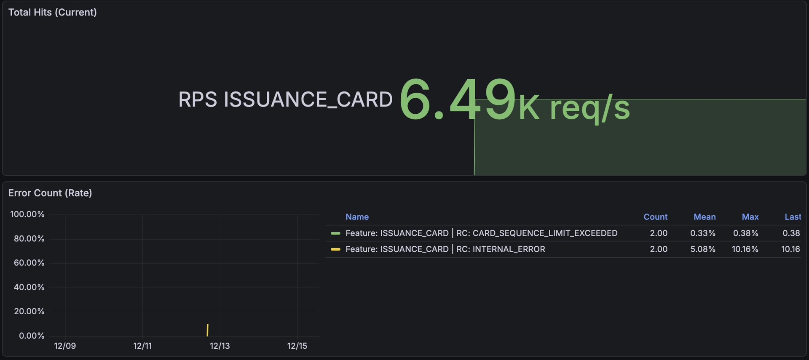
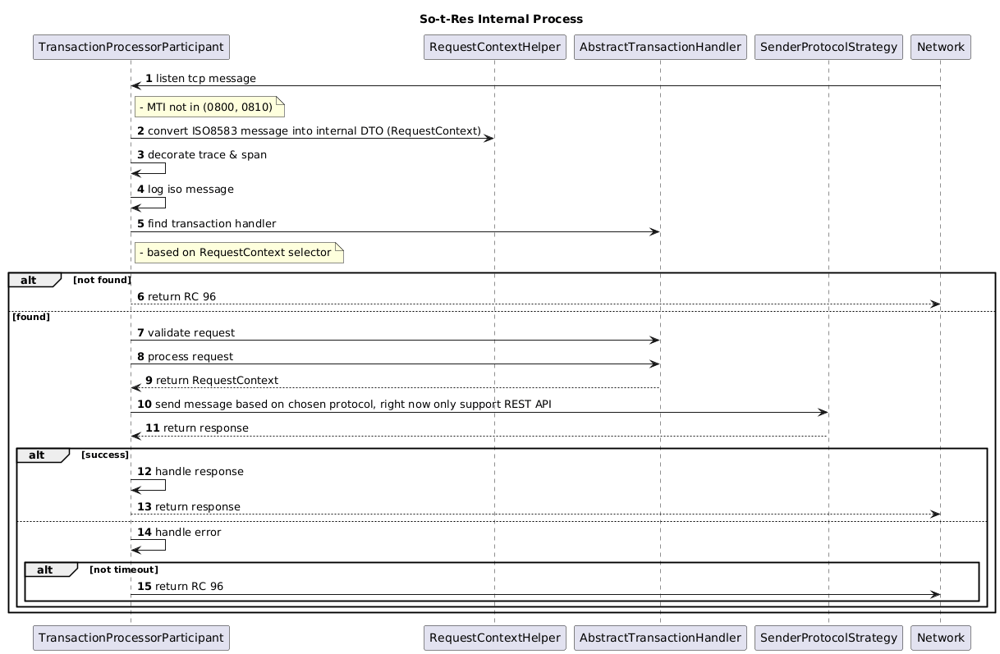

# So-t-Res


## Introduction
This document provides technical specifications and operational details for the Spring Boot Boilerplate Project with main capabilities to convert ISO8583 message to JSON REST API.
This project serves as a foundational, reactive, single-module application built on the Spring Boot framework and [jreactive8583](https://github.com/kpavlov/jreactive-8583), 
designed to incorporate common enterprise capabilities like robust logging, retry mechanisms, and operational endpoints.

## Project Structure

### Module Structure
`src/main/java` The project employs a standard single-module structure, organized by functional concern to promote separation of duties and maintainability.

| Package       | Description                               | Key Responsibilities                                                                                      |
|---------------|-------------------------------------------|-----------------------------------------------------------------------------------------------------------|
| API           | Houses all REST API endpoint controllers. | Defines application-facing services and handles HTTP request mapping.                                     |
| Client        | External Client Integration.              | Contains components for making outbound calls to external services.                                       |
| Configuration | Application Configuration.                | Stores Spring bean definitions, external library setups, and general application helpers.                 |
| Entity        | Data Persistence Layer.                   | Stores POJO classes that map directly to database tables (JPA Entities).                                  |
| Factory       | Component Creation.                       | Used for creating or managing implementations of specific beans or components.                            |
| Helper        | General Utility Classes.                  | Stores reusable utility and helper methods.                                                               |
| Interceptor   | Request/Response Processing Hooks.        | Contains logic executed before or after request/response processing (e.g., logging, header manipulation). |
| Listener      | Event Handling.                           | Stores classes that listen for and react to application or external events.                               |
| Model         | Data Transfer Objects (DTOs).             | Stores request/response DTOs, constants, and enums for data structuring.                                  |
| Participant   | Base Handler for Incoming ISO8583.        | ISO8583 Handler for incoming message seggregated based on transaction / network message                   |
| Properties    | Configuration Definitions.                | Stores custom application configuration properties, designed to be environment-overridable.               |
| Repository    | Data Access Layer.                        | Defines interfaces for database query operations (e.g., Spring Data JPA repositories).                    |
| Service       | Contains the core business logic.         | Orchestrates business processes, independent of persistence or transport layers.                          |
| Strategy      | Strategy Pattern Classes.                 | Strategy Pattern for ISO8583 transaction message                                                          |

### Supporting Files
- `.docker` Contains the Dockerfile for building a standardized Docker container image of the application.
- `.deployment` Stores environment variables required for running the application via Docker containers.
- `.script` Holds shell scripts for common operational tasks, such as building the JAR, building the Docker image, and running the application.

## Core Capabilities and Features
The boilerplate includes several advanced features to enhance observability, reliability, and operational control.

### Logging
| Feature                             | Description                                                                                               | Configuration                                                                                                                                                                                                |
|-------------------------------------|-----------------------------------------------------------------------------------------------------------|--------------------------------------------------------------------------------------------------------------------------------------------------------------------------------------------------------------|
| Structured & Segregated Logging     | Logs are output in a custom JSON format for machine readability and segregated into distinct files.       | App Log: `${LOG_PATH}/${APPLICATION_NAME}.log` Metric Log: `${LOG_PATH}/metrics.log` Trace Log: `${LOG_PATH}/trace.log`                                                                                      |
| Response Time Tracing               | Automatically logs the duration/response time of each endpoint call.                                      | Enabled by default. Disable with: `apps.log.enable-trace-log=false`. Paths can be ignored using `apps.log.ignored-path`.                                                                                     |
| ISO & HTTP Request/Response Logging | Logs the full content of incoming requests and outgoing responses.                                        | Enabled by default. Disable with: `apps.log.enable-api-log=false`.                                                                                                                                           |
| Masking Sensitive PII               | Automatically masks PII (Personally Identifiable Information) in logs generated by external client calls. | Define sensitive fields in configuration: `apps.masking.sensitive-field` and in `system_properties` table with group_id `mask_fields`. Space separated value. Supports both headers and JSON payload fields. |

> Note on Logging Usage: Developers must use the custom wrapper (`AppLogMessage`) with `Log4j2` annotation to ensure structured JSON logging is correctly populated with context (HTTP details, errors, etc.).

Example:
```java
@Log4j2
public class ExampleController {
  public void method() {
    log.info(AppLogMessage
        .message("log message {} {}", "p1", "p2")
        .httpRequest(request)
        .httpResponse(response)
        .isoMessage(isoMessage)
        .error(throwable)
        .additionalData(additionalData)
    );
  }
}
```

### Observability
The application is configured to expose standard and custom feature-level metrics compatible with Prometheus.
- Endpoint: Metrics are exposed on a dedicated port: `http://localhost:1000/actuator/prometheus`.
- Default Port: Port `1000` is used exclusively for the metrics endpoint, separating it from the main application traffic port.

#### Feature Name Matching Mechanism
To utilize feature-level metrics, the developer must explicitly define the feature name mapping:

- Configuration Requirement: Developers must add an enum entry to the `ApiFeatureConstant` class for REST API and `IsoFeatureConstant` for ISO8583 transaction messages.
- Matching Logic: 
  - When an incoming HTTP request is processed, the application attempts to match the request's HTTP Method (e.g., GET, POST) and the API Path (e.g., /api/user/{id}) against the defined entries in `ApiFeatureConstant`.
  - When an ISO8583 message is processed, the application attempts to match the message's MTI (Message Type Indicator) & selector against the defined entries in `IsoFeatureConstant`.
- Metrics Scraping: If a match is found, the corresponding enum name from `ApiFeatureConstant` & `IsoFeatureConstant` is used as the feature name tag when the metrics are scraped by Prometheus, allowing for targeted monitoring of specific business transactions.

Example:


## ISO8583 Handler
ISO8583 using TCP protocol, so it can both as a client and server. which means it can be used to send and receive a message simulatenously.

### ISO8583 as a sender
to use as a client, you need to inject bean `Iso8583Client<IsoMessage>` into your class.

Example:
```java
iso8583Client.send(request, isoMessageProperties.network().timeOut(), TimeUnit.MILLISECONDS);
```

### ISO8583 as a receiver
to use as a server, you need to extends `IsoMessageListener<IsoMessage>` class.
or in this boilerplate, it's already handled on `TransactionProcessorParticipant` class.
and you need to create bean that extends `AbstractTransactionHandler` class.

