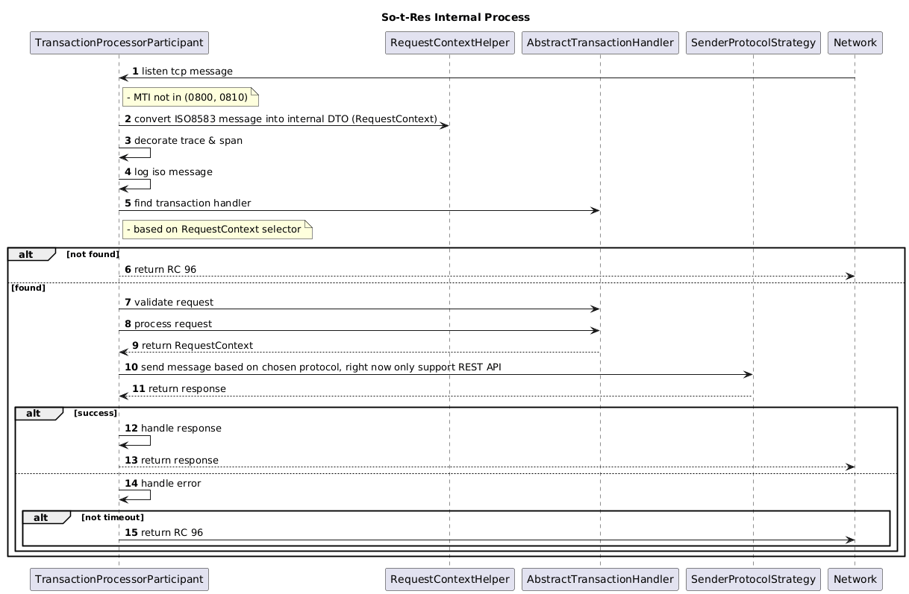
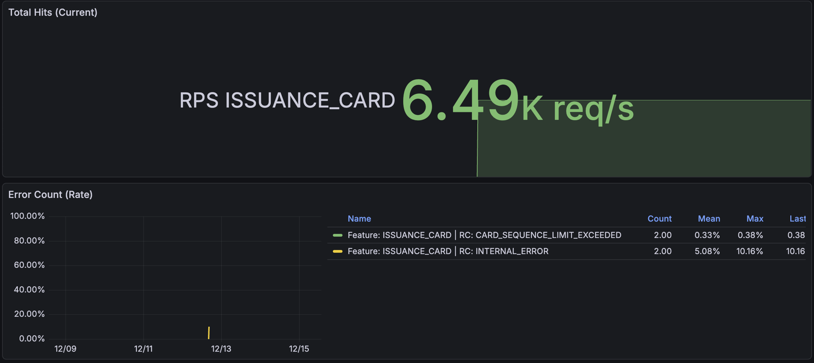

# So-t-Res — ISO8583 to REST Gateway


A Spring Boot boilerplate that bridges an ISO8583 TCP channel to downstream REST APIs.
Incoming financial messages (0200 authorisations, 0420 reversals, 0800 network) are decoded,
enriched, shape-transformed via JSLT templates, and forwarded to any REST backend — then the
ISO8583 response is written back to the originating TCP connection.

The runtime is **blocking-on-virtual-threads**, not reactive: jReactive-8583 keeps its Netty
transport, every inbound message is handed straight off the event loop onto a virtual-thread
executor, and all downstream work (JDBC, `RestClient`, JSLT) runs synchronously from there. The
HTTP layer is servlet MVC (Tomcat) on virtual request threads.

---

## Table of Contents

- [Overview](#overview)
- [Architecture](#architecture)
- [Project Structure](#project-structure)
- [Features](#features)
- [API Reference](#api-reference)
- [Configuration](#configuration)
- [Local Development](#local-development)
- [Database](#database)

---

## Overview

sotres owns the translation layer between an ISO8583 acquirer or switch and one or more downstream
REST services. It accepts ISO8583 messages over a persistent TCP connection, converts them to JSON
via configurable JSLT templates, posts to the mapped REST endpoint, then maps the JSON response
back into an ISO8583 0210/0430/0810 reply.

Secondary responsibilities:

- **Outbound retry + dead-letter** — `RestSender.executeWithRetry` wraps the downstream call in a classic `spring-retry` `RetryTemplate` (`apps.retry.configurations.*`); on exhaustion `RestSenderRetryListener` persists a `dead_letter_process` row. The reprocessing side (`AbstractRetryProcessorService`) stays an extension point — ships **no concrete processor**
- **Audit logging** — every HTTP request processed by the service is written to `event_logs`
- **Runtime configuration** — all routing tables, acquirer maps, response mappings, and JSLT templates are stored in `system_properties` and can be reloaded at runtime without restart
- **Network management** — sign-on, sign-off, and echo messages are handled and exposed as operational endpoints

**Runtime**: Spring Boot 3.5.16 · Java 25 · servlet (Tomcat) + virtual threads · PostgreSQL via Spring Data JPA / Hibernate

---

## Architecture

```
┌─────────────────────────────────┐   ┌──────────────────────────────────┐
│  ISO8583 TCP (port 13001)       │   │  HTTP Clients (port 8080)        │
└──────────────┬──────────────────┘   └───────────────┬──────────────────┘
               │                                      │
               ▼                                      ▼
┌─────────────────────────────────┐   ┌──────────────────────────────────┐
│  Participant Layer              │   │  REST Layer                      │
│  TransactionProcessorParticipant│   │  ExampleController               │
│  NetworkProcessorParticipant    │   │  (internal) DeadLetterProcess-   │
│  TransactionResponseParticipant │   │  Controller, EventLogController, │
└──────────────┬──────────────────┘   │  NetworkController,              │
               │                      │  SystemPropertiesController,     │
               ▼                      │  JsltAdminController             │
┌─────────────────────────────────┐   └───────────────┬──────────────────┘
│  Strategy Layer                 │                   │
│  RestProtocolStrategy           │                   ▼
│  AbstractTransactionHandler     │   ┌──────────────────────────────────┐
└──────────────┬──────────────────┘   │  Service Layer                   │
               │                      │  SystemPropertiesService          │
               ▼                      │  DeadLetterProcessService         │
┌─────────────────────────────────┐   │  EventLogService                 │
│  Client Layer                   │   │  NetworkService                  │
│  TransactionClient (RestClient) │   └───────────────┬──────────────────┘
│  JsltTransformationHelper       │                   │
└──────────────┬──────────────────┘                   │
               │                                      │
               ▼                                      ▼
┌──────────────────────────────────────────────────────────────────────────┐
│  Repository Layer  (Spring Data JPA / Hibernate)                        │
│  SystemPropertiesRepository · DeadLetterProcessRepository                │
│  EventLogRepository                                                      │
└──────────────────────────────┬───────────────────────────────────────────┘
                               │
                               ▼
                         PostgreSQL 14+
```

### Key design decisions

**Off the event loop, onto virtual threads**

jReactive-8583's Netty transport is kept, but `TransactionProcessorParticipant.onMessage` does no
work on the event loop: it hands the message to `isoTransactionAsyncTaskExecutor` (virtual threads,
sized by a `Semaphore` bulkhead) and returns `false` immediately. Everything downstream — JSLT,
JDBC via Hibernate, the outbound `RestClient` — is ordinary blocking code. Reactor is not on the
classpath.

**Response correlation modes**

Two modes handle the asymmetric nature of ISO8583 — where a 0200 request and its 0210 reply may
arrive on different threads or even sockets. Both are backed by one class, `CorrelationRegistry`
(a two-window Caffeine design: an in-flight `CompletableFuture` map + a `registered` grace-window
map). Selected per-selector via `system_properties[registry]` and globally via
`CLIENT_REGISTRY_TYPE`:

| Mode | Behaviour |
|---|---|
| `CALLBACK` | Fire-and-forget send (`EnhancedIsoClient.sendWithCallback`). The 0210 is consumed asynchronously by `TransactionResponseParticipant`; `TransactionProcessorParticipant.isResponseRegistryEnabled` yields so the processor doesn't also handle it. A reply after the in-flight window but inside the grace window is a `LATE_RESPONSE`. |
| `RESPONSE` | `EnhancedIsoClient.send(msg, timeout)` blocks the caller's virtual thread on the `CompletableFuture` until the 0210 arrives, or the timeout fires and a synthetic DE39 error is returned. A straggler after the timeout is an `ORPHAN`. |

**JSLT transformation**

Each selector (derived from MTI + processing code + product indicator) maps to two JSLT templates
in `system_properties`: request shaping (`client_spec_request`) and response normalisation
(`client_spec_response`). `JsltTransformationHelper.transform(...)` returns a `JsonNode`
synchronously. Compiled expressions are held in a Caffeine `Cache<String, Optional<Expression>>`
(`expireAfterWrite(10m)`); `Optional.empty()` is the "no template configured, pass through"
sentinel and is cached like any other entry, so a mis-configured selector stops hitting the
database on every message.

**Bounded retry and dead-letter on the outbound call**

`RestSender.executeWithRetry` wraps the downstream POST in a classic `spring-retry`
`RetryTemplate`, one per `apps.retry.configurations.<name>` entry, built by
`RetryTemplateConfiguration` and looked up through `RetryTemplateHelper`. The policy is a
`SimpleRetryPolicy` (total attempts + subclass-aware whitelist/blacklist from
`retryable-exceptions`) plus a `BackOffPolicy` chosen by `type` — jittered exponential by default,
so a downstream outage does not turn into a synchronised retry storm across virtual threads. When
the budget is exhausted, `RestSenderRetryListener` (registered on the template) reads the request
metadata off the `RetryContext` and writes one fresh `dead_letter_process` row; the failure still
propagates to `RestProtocolStrategy.handleError`, which sends DE39=96 (`SYSTEM_MALFUNCTION`) for a
genuine downstream error but stays **silent on a timeout** — the downstream may have processed the
request, so the acquirer/switch reverses rather than the gateway guessing a decline.

Retry defaults to **off** (`max-attempt = 1`): the default retryable exception is a read timeout,
which is exactly the "maybe processed" case, so retry is only safe when the downstream deduplicates
on `x-request-id` (the RRN).

**System properties cache**

All routing and configuration data is held in a `ConcurrentHashMap`-backed in-memory map
(`SystemPropertiesServiceImpl`), keyed by `ConfigGroup`, loaded at startup. Individual groups can
be reloaded at runtime via the admin API without restarting the process. (Caffeine is also used by
`CorrelationRegistry` and `JsltTransformationHelper`, but not for this cache.)

---

## Project Structure

```
src/main/java/com/nantaaditya/sotres/
├── api/
│   ├── ExampleController.java          # Boilerplate greeting / error demo
│   ├── BaseController.java             # Shared response building and observation
│   └── internal/
│       ├── DeadLetterProcessController # Purge and manual retry of failed calls
│       ├── EventLogController          # Purge aged HTTP audit records
│       ├── JsltAdminController         # JSLT template CRUD and cache management
│       ├── NetworkController           # ISO8583 sign-on / sign-off / echo
│       └── SystemPropertiesController  # Runtime config reload and inspection
├── client/
│   └── TransactionClient.java          # Blocking RestClient for downstream REST
├── configuration/                      # Spring bean and library configuration
├── entity/
│   ├── DeadLetterProcess.java          # Failed outgoing calls pending retry
│   ├── EventLog.java                   # HTTP request audit trail
│   └── SystemProperties.java          # Runtime key-value configuration store
├── factory/                            # Component creation and strategy resolution
├── helper/
│   ├── JsltTransformationHelper.java   # JSLT compile-once cache and transform
│   ├── AppLogMessage.java              # Structured log builder
│   └── ...                            # Date, string, field, masking utilities
├── interceptor/
│   ├── HeaderFilter.java               # OncePerRequestFilter: body cache, context, observation
│   ├── EventLogInterceptor.java        # HandlerInterceptor: writes the event_logs audit row
│   └── ResponseHeaderInterceptor.java  # ResponseBodyAdvice: adds x-response-time
├── listener/                           # Log layouts + RestSenderRetryListener (dead-letter on retry exhaustion)
├── model/
│   ├── constant/                       # ApiResponseCode, ConfigGroup, TemplateGroup enums
│   ├── dto/                            # RequestContext, ResponseContext
│   ├── error/                          # Domain exception types
│   ├── logger/                         # AppLogMessage builder model
│   ├── request/                        # Validated API request records
│   └── response/                       # Response envelope
├── participant/
│   ├── TransactionProcessorParticipant # Decodes inbound ISO8583 transactions
│   ├── NetworkProcessorParticipant     # Handles 0800 network messages
│   └── TransactionResponseParticipant  # Routes unsolicited 0210 responses
├── properties/                         # @ConfigurationProperties bindings
├── repository/                         # Spring Data JPA repositories
├── service/
│   ├── internal/                       # Service interfaces
│   └── impl/                           # Implementations
└── strategy/
    ├── outgoing/                       # RestProtocolStrategy — sends to REST
    └── transaction/                    # AbstractTransactionHandler and extensions
```

---

## Features

### ISO8583 transaction forwarding



Incoming ISO8583 financial messages (0200, 0420, 0421–0423) are decoded by
`TransactionProcessorParticipant` — which hands off to a virtual-thread executor before doing any
work — enriched by the matching `AbstractTransactionHandler`, then forwarded to a downstream REST
endpoint by `RestProtocolStrategy` via a blocking `RestClient`. The response is mapped back to an
ISO8583 0210/0430 reply and written to the originating TCP channel.

### JSLT request and response transformation

Each transaction selector maps to two JSLT templates in `system_properties`. The request template
reshapes the internal `RequestContext` into the exact JSON body expected by the downstream REST API.
The response template normalises the downstream reply into a `ResponseContext` that the ISO8583
layer can translate to a wire response. Templates are compiled once on first use and cached; if no
template is configured for a selector the raw object passes through as-is.

### Dead-letter retry (producer wired; consumer is the extension point)

The **producer is now live**: when an outbound `RestSender.executeWithRetry` call exhausts its
`apps.retry.configurations.<name>` budget, `RestSenderRetryListener` writes a fresh
`dead_letter_process` row (`status = NEW`, `retry_count = 0`, `max_retry` = the configured
`max-attempt`, `payload` + `headers` + `retry_histories` captured). The rest of the scaffold —
the table, `DeadLetterProcessService` (`@Async void remove/retry`), the
`AbstractRetryProcessorService` SPI, and the admin endpoints for purge + targeted retry by
`processType` + `processName` — is unchanged. What the boilerplate still does **not** ship is a
concrete `RetryProcessorService` (the consumer): register one to actually reprocess the rows;
`retry` runs a sequential loop on the async executor and marks rows `EXHAUSTED` at `max_retry`.

### HTTP request audit log

Every HTTP request handled by the service is recorded to `event_logs` by `EventLogInterceptor`
(`HandlerInterceptor.afterCompletion`) after the response is sent. The `ContextDTO` it needs is
built in `HeaderFilter` and passed on a request attribute. Audit records include client ID, request
ID, method, path, response code, payload, and timestamp. Old records can be purged in bulk by age.

### ISO8583 network management

Sign-on (0800/logon), sign-off (0800/logoff), and echo (0800/echo) messages are handled by
`NetworkProcessorParticipant`. The channel health state is tracked by `HealthCheckHelper`. Operators
can trigger these messages on demand via the internal API.

### Runtime configuration without restart

All routing tables (path mappings, acquirer lists, MTI whitelists, response code translations) and
JSLT templates are stored in `system_properties` and loaded into an in-memory cache at startup.
Individual property groups can be reloaded at any time via the admin API, and JSLT expression caches
can be evicted and rewarmed per-selector or globally.

### Observability

- **Structured logging** — JSON log output via Log4j2 + LMAX Disruptor async appender. Use
  `AppLogMessage.message(...)` to emit structured entries enriched with ISO8583 message, HTTP
  context, and errors.
- **Prometheus metrics** — exposed on the actuator port (`/actuator/prometheus`). Feature-level
  tagging via `ApiFeatureConstant` (REST) and `IsoFeatureConstant` (ISO8583) enums.
- **Distributed tracing** — Brave/B3 + W3C propagation via Micrometer, with configurable baggage
  fields (default: `x-request-id`).
- **Micrometer Observation tracking** — every request lifecycle (inbound HTTP via `HeaderFilter`,
  ISO8583 message handling via the participant layer, outbound REST calls via `TransactionClient`)
  is wrapped in a Micrometer `Observation`, named via `ObservationConstant`
  (`API_PUBLIC`/`API_EXTERNAL`/`ISO_MESSAGE`) and tagged consistently through `ObservationHelper`
  (`requestId`, `feature`, `responseCode`, `error`). On the HTTP path, `HeaderFilter` starts the
  `Observation`, opens its scope for the request thread, and stashes it on a request attribute
  (`ObservationWrapper`) so `BaseController.toResponse` / `ApiExceptionHandler` can tag it with the
  response code — no Reactor `Context`, because request handling stays on one (virtual) thread. On
  the ISO path the participant opens the scope on the worker thread it hands off to.


---

## API Reference

All responses use a common envelope:

```json
{
  "response": {
    "code": "000",
    "description": "success",
    "time": "2026-07-12T10:00:00.000+07:00"
  },
  "data": {},
  "error": null
}
```

**Response codes**

| Code | Constant | Meaning |
|------|----------|---------|
| `000` | `SUCCESS` | Request processed successfully |
| `900` | `INVALID_PARAMS` | Bean validation failure — check `error.violations` |
| `998` | `BAD_REQUEST` | Business rule rejection |
| `999` | `INTERNAL_ERROR` | Unexpected server error |

---

### Example

#### `GET /sotres/api/example?name=Alice`

Health-check / smoke-test endpoint.

**Response `200`**
```json
{
  "response": { "code": "000", "description": "success", "time": "..." },
  "data": "Hi Alice!"
}
```

---

### Internal API

> These endpoints are intended for platform operations only. They are served under
> `/sotres/internal-api/**` and excluded from API audit logs by default.

#### `GET /internal-api/network/sign-on`

Sends an ISO8583 0800 logon message to the upstream host and marks the channel as signed on.

**Response `200`**
```json
{ "response": { "code": "000", "description": "success", "time": "..." }, "data": true }
```

#### `GET /internal-api/network/sign-off`

Sends an ISO8583 0800 logoff message and marks the channel as signed off.

#### `GET /internal-api/network/echo`

Sends an ISO8583 0800 echo and returns the health check result.

---

#### `DELETE /internal-api/dead_letter_process?days=30`

Purges dead-letter records older than `days` (default 30). Returns immediately; deletion runs asynchronously.

#### `POST /internal-api/dead_letter_process/_retry`

Triggers immediate retry of dead-letter records matching the given process type and name.

**Request**
```json
{
  "processType": "TRANSACTION",
  "processName": "outgoing-rest-call",
  "size": 10
}
```

**Response `200`**
```json
{ "response": { "code": "000", "description": "success", "time": "..." }, "data": true }
```

**Validation error `400`**
```json
{
  "response": { "code": "900", "description": "invalid parameters", "time": "..." },
  "error": { "violations": { "processType": ["NotBlank"], "size": ["MustPositive"] } }
}
```

---

#### `DELETE /internal-api/event_log?days=30`

Purges audit log records older than `days` (default 30). Runs asynchronously.

---

#### `GET /internal-api/configurations?key=PATH_MAPPING`

Returns the in-memory cache contents for a `ConfigGroup`.

Valid `key` values: `PATH_MAPPING`, `ACQUIRERS`, `INCOMING_MTI`, `OUTGOING_MTI`,
`CURRENCY_FRACTIONS`, `RESPONSE_MAPPING`, `REGISTRY_CALLBACK_SELECTOR`,
`REGISTRY_RESPONSE_SELECTOR`, `ISO8583_MASK_FIELDS`. (`CLIENT_SPEC_REQUEST` /
`CLIENT_SPEC_RESPONSE` are `TemplateGroup` values, used only by the JSLT template endpoints —
not valid here.)

**Response `200`**
```json
{
  "response": { "code": "000", "description": "success", "time": "..." },
  "data": { "10.97-E001": "/api/transaction" }
}
```

#### `PUT /internal-api/configurations/_reload?group=PATH_MAPPING`

Reloads a single property group from the database into the in-memory cache.

---

#### `PUT /internal-api/jslt/template?selector=10.97-E001&group=CLIENT_SPEC_REQUEST`

Creates or updates a JSLT template for the given selector and direction. Body is plain text
(`Content-Type: text/plain`). Evicts the compiled expression after save so the next transform
picks up the new template.

**Request body** (raw JSLT)
```
{"amount": .amount, "currency": .currency, "pan": .cardNo}
```

**Response `200`**
```json
{
  "response": { "code": "000", "description": "success", "time": "..." },
  "data": {
    "id": 42,
    "groupId": "client_spec_request",
    "propertyId": "10.97-E001",
    "propertyValue": "{\"amount\": .amount, \"currency\": .currency, \"pan\": .cardNo}"
  }
}
```

#### `GET /internal-api/jslt/templates?selector=10.97-E001`

Returns the current raw template text for both directions of a selector (does not recompile).

**Response `200`**
```json
{
  "response": { "code": "000", "description": "success", "time": "..." },
  "data": {
    "client_spec_request": "{\"amount\": .amount, \"currency\": .currency}",
    "client_spec_response": "{\"response\": {\"code\": .responseCode}}"
  }
}
```

#### `POST /internal-api/jslt/_reload?selector=10.97-E001`

Evicts the compiled expression cache for both directions of a selector, re-fetches from the
database, and recompiles. Returns the reloaded template text.

#### `POST /internal-api/jslt/_reload-all`

Clears the entire JSLT expression cache and rewarms it from the database for all selectors.

---

## Configuration

All values are injectable via environment variable. Full reference: [`docs/ENVIRONMENT_VARIABLES.md`](docs/ENVIRONMENT_VARIABLES.md).

### Server

| Variable | Default | Description |
|---|---|---|
| `SERVER_PORT` | `8080` | HTTP API port |
| `ACTUATOR_PORT` | `1000` | Actuator / metrics port |
| `CONTEXT_PATH` | `/sotres` | Servlet context path (`server.servlet.context-path`) |
| `APPLICATION_NAME` | `sotres-api` | Spring application name |
| `VIRTUAL_THREAD_ENABLED` | `true` | Run Tomcat request threads + async executors on virtual threads |

### Database

| Variable | Default | Description |
|---|---|---|
| `DB_URL` | `jdbc:postgresql://localhost:5432/boilerplate` | JDBC connection URL |
| `DB_USER` | `postgres` | Database username |
| `DB_PASS` | `changeme` | Database password — **rotate before production** |
| `DB_POOL_MAX_SIZE` | `10` | HikariCP maximum pool size |
| `DB_POOL_MIN_IDLE` | `5` | HikariCP minimum idle connections |
| `JPA_DDL_AUTO` | `none` | Hibernate `ddl-auto` — schema is managed externally via `ddl.sql` |
| `JPA_SHOW_SQL` | `true` | Log generated SQL (set `false` in production) |

### ISO8583 Connection

| Variable | Default | Description |
|---|---|---|
| `ISO8583_HOST` | `127.0.0.1` | ISO8583 upstream host |
| `ISO8583_PORT` | `13001` | ISO8583 upstream TCP port |
| `FORWARDING_INSTITUTION_ID` | `625` | Institution ID written to DE33 |
| `RECONNECT_INTERVAL` | `60000` | Reconnect interval (ms) |
| `TIME_OUT_SECOND` | `15000` | ISO8583 response timeout (ms) |
| `SCHEDULED_ECHO_ENABLED` | `true` | Send periodic echo heartbeats |
| `ECHO_INTERVAL_SECOND` | `30000` | Echo interval (ms) |

### Outgoing REST Client

| Variable | Default | Description |
|---|---|---|
| `OUTGOING_PROTOCOL` | `REST` | Forwarding protocol (currently `REST` only) |
| `CLIENT_REGISTRY_TYPE` | `CALLBACK` | Response correlation mode (`CALLBACK` or `RESPONSE`) |
| `TRANSACTION_CLIENT_HOSTNAME` | `http://localhost:8080` | Downstream REST base URL |
| `TRANSACTION_CLIENT_READ_TIMEOUT` | `10000` | `RestClient` read timeout (ms) |

### Outbound Retry (`apps.retry.configurations.transaction`)

> ⚠️ Retry is **off by default** (`max-attempt = 1`). The default retryable set is
> `ResourceAccessException`, which includes read timeouts — where the downstream may already have
> processed the request. Raise `TRANSACTION_RETRY_MAX_ATTEMPT` only if the downstream is
> **idempotent on `x-request-id` (the RRN)**, or a retried auth/capture can double-charge.

| Variable | Default | Description |
|---|---|---|
| `TRANSACTION_RETRY_TYPE` | `EXPONENTIAL_RANDOM` | Backoff strategy: `FIXED` / `EXPONENTIAL` / `EXPONENTIAL_RANDOM` / `UNIFORM_RANDOM` |
| `TRANSACTION_RETRY_MAX_ATTEMPT` | `1` | Total executions incl. the first (`1` = no retry) |
| `TRANSACTION_RETRY_DEAD_LETTER` | `true` | Persist an exhausted call to `dead_letter_process` (else log only); never written when `max-attempt = 1` |
| `TRANSACTION_RETRY_INITIAL_INTERVAL` | `500` | First backoff / fixed period / uniform min (ms) |
| `TRANSACTION_RETRY_MULTIPLIER` | `2.0` | Exponential growth factor |
| `TRANSACTION_RETRY_MAX_INTERVAL` | `10000` | Backoff cap / uniform max (ms) |
| `TRANSACTION_RETRYABLE_EXCEPTIONS` | `org.springframework.web.client.ResourceAccessException:true` | `FQCN:boolean` pairs — `true` whitelist, `false` blacklist; subclass-aware |

### Logging

| Variable | Default | Description |
|---|---|---|
| `LOG_PATH` | `logs/` | Log file directory |
| `APPS_LOG_LEVEL` | `json` | Log format: `json` or `text` |
| `APPS_API_ENABLED` | `true` | Logbook logging of outbound RestClient calls |
| `APPS_INBOUND_API_ENABLED` | `true` | Logbook logging of inbound requests to this app's endpoints |
| `SENSITIVE_FIELD` | `cardNo` | Comma-separated JSON fields to mask in logs |

### Observability

| Variable | Default | Description |
|---|---|---|
| `ACTUATOR_EXPOSED` | `*` | Exposed actuator endpoints — restrict in production |
| `PROMETHEUS_ENABLED` | `true` | Enable Prometheus metrics export |
| `TRACING_SAMPLING_PROBABILITY` | `1.0` | Trace sampling rate (reduce in high-traffic prod) |
| `ROOT_LOG_LEVEL` | `INFO` | Root log level — set `WARN` in production |

---

## Local Development

**Prerequisites**: Java 25, Maven 3.9+, PostgreSQL 14+

**1. Initialise the database** (first time only)
```bash
psql -U postgres -d boilerplate -f src/main/resources/ddl.sql
psql -U postgres -d boilerplate -f src/main/resources/dml.sql
```

**2. Run**
```bash
mvn spring-boot:run
```

All environment variables have defaults; no overrides are required for local runs against
`localhost:5432/boilerplate` with user `postgres` / password `changeme`.

- API base: `http://localhost:8080/sotres`
- Swagger UI: `http://localhost:8080/sotres/swagger-ui.html`
- Actuator: `http://localhost:1000/actuator/health`

**3. Run tests**
```bash
mvn test

# Tests + JaCoCo coverage report
mvn verify
open target/site/jacoco/index.html
```

**Docker**
```bash
# Build JAR
bash .script/build_jar.sh

# Build image
bash .script/build_docker.sh

# Run container
docker run -d \
  --cpus="0.5" --memory="768m" \
  -p 8080:8080 \
  --env-file .env/dev.env \
  --name sotres \
  sotres:1.0.0-SNAPSHOT
```

Create `.env/dev.env` with the variables listed in the [Configuration](#configuration) section,
overriding any defaults for your environment.

**Structured logging**

Use `AppLogMessage` with `@Log4j2` to emit properly structured JSON log entries:

```java
@Log4j2
public class MyHandler {
  public void handle() {
    log.info(AppLogMessage
        .message("processing transaction {} for amount {}", rrn, amount)
        .isoMessage(isoMessage)
        .error(throwable)        // optional — include on exceptions
    );
  }
}
```

**Feature metrics**

Add an entry to `ApiFeatureConstant` (for REST requests) or `IsoFeatureConstant` (for ISO8583
messages) to tag Prometheus metrics with a business feature name. The matching logic compares
HTTP method + path or MTI + selector against the enum entries at scrape time.

---

## Database

Schema is managed via SQL scripts in `src/main/resources/`.

```bash
# Create tables
psql -U postgres -d boilerplate -f src/main/resources/ddl.sql

# Seed required system_properties rows
psql -U postgres -d boilerplate -f src/main/resources/dml.sql
```

**Tables**

| Table | Purpose |
|---|---|
| `dead_letter_process` | Failed outgoing REST calls pending scheduled or manual retry |
| `system_properties` | Runtime key-value configuration: routing tables, JSLT templates, acquirer maps |
| `event_logs` | Immutable HTTP request audit trail written after each response |

**Seed data (`dml.sql`)**

| `group_id` | `property_id` | Content |
|---|---|---|
| `acquirers` | `acquirers` | Acquirer network routing map (e.g. `360001:ARTAJASA`) |
| `mti` | `incoming` | Allowed inbound MTI whitelist |
| `mti` | `outgoing` | Allowed outbound MTI whitelist |
| `mask_fields` | `iso8583` | ISO8583 DE field numbers to mask in logs (e.g. `2` for PAN) |
| `currency` | `fractions` | Currency decimal digits (e.g. `360:2` = IDR, 2 dp) |
| `endpoint_path` | `mapping` | Selector → REST path map (e.g. `10.97-E001:/api/transaction`) |
| `response` | `incoming_outgoing_mapping` | Response code translation (e.g. `00:00`) |
| `registry` | `callback_selector` | Selectors using `CALLBACK` correlation mode |
| `registry` | `response_selector` | Selectors using `RESPONSE` correlation mode |

**Primary key strategy**

`event_logs` uses a TSID (Time-Sorted ID) string primary key from
[tsid-creator](https://github.com/f4b6a3/tsid-creator), assigned by a Hibernate custom
`@IdGeneratorType` (`entity/TimeSeriesId` → `TsidGenerator`) — k-sortable, compact, collision-free,
no sequence. `dead_letter_process` and `system_properties` use PostgreSQL `bigserial`
(`@GeneratedValue(IDENTITY)`).

**JSLT templates**

After seeding, add JSLT transformation templates via the admin API or directly:

```sql
-- Request template: shape RequestContext into downstream REST body
INSERT INTO system_properties (group_id, property_id, property_value)
VALUES ('client_spec_request', '10.97-E001', '{"amount": .amount, "currency": .currency}');

-- Response template: normalise downstream response into ResponseContext fields
INSERT INTO system_properties (group_id, property_id, property_value)
VALUES ('client_spec_response', '10.97-E001', '{"response": {"code": .responseCode}}');
```
