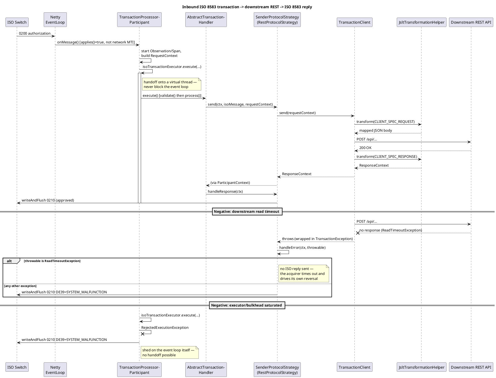
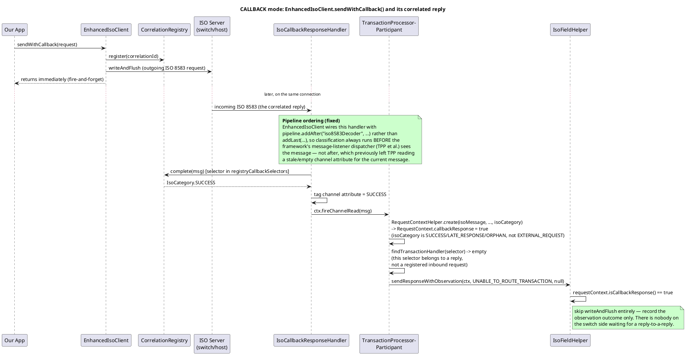
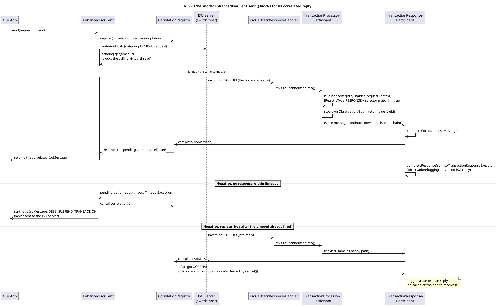

# So-T-Res

ISO 8583 to REST Api


---

## Table of Contents

- [Overview](#overview)
- [Architecture](#architecture)
- [Project Structure](#project-structure)
- [Features](#features)
- [API Reference](#api-reference)
- [Configuration](#configuration)
- [Local Development](#local-development)
- [Database](#database)

---

## Overview

sotres is a gateway that translates inbound ISO 8583 card-transaction messages from an upstream switch/acquirer into REST calls against a downstream payment API, then maps the REST response back into an ISO 8583 reply. 
It owns the wire protocol, the request/response field mapping (via configurable JSLT templates), correlation of async replies, and failure recovery (retry + dead-letter) for the downstream leg.

Secondary responsibilities:
- Operational endpoints to drive the ISO 8583 connection (sign-on/sign-off/echo) and to inspect/repair failed transactions
- DB-backed configuration (routing tables, currency fractions, response-code mappings) that can be hot-reloaded without a restart
- Per-request audit logging with PAN/PCI-sensitive field masking in logs

**Runtime**: `Spring Boot 3.5.16` · `Java 25` · `Servlet (Tomcat)` + `virtual threads` · `PostgreSQL`

---

## Architecture

```
                 Upstream ISO 8583 switch/acquirer
                            │
                            ▼
              ┌───────────────────────────┐
              │  Netty (jReactive-8583)   │
              │  event loop               │
              └─────────────┬─────────────┘
                            │ handoff (never block the event loop)
                            ▼
              ┌───────────────────────────┐
              │  Participants             │
              │  TransactionProcessor-    │
              │  Participant,             │
              │  TransactionResponse-     │
              │  Participant              │
              │  (virtual-thread          │
              │  executors)               │
              └─────────────┬─────────────┘
                            ▼
              ┌───────────────────────────┐
              │  Strategy + JSLT          │
              │  transform (request/      │
              │  response field mapping)  │
              └─────────────┬─────────────┘
                            ▼
              ┌───────────────────────────┐
              │  RestSender (Apache       │
              │  HttpClient 5, Spring     │
              │  Retry + dead-letter)     │
              └─────────────┬─────────────┘
                            ▼
                 Downstream REST payment API


        Operators / internal tooling
                            │
                            ▼
              ┌───────────────────────────┐
              │  REST Layer               │
              │  (api/internal/*          │
              │  Controllers)             │
              └─────────────┬─────────────┘
                            ▼
              ┌───────────────────────────┐
              │  Service Layer            │
              └─────────────┬─────────────┘
                            ▼
              ┌───────────────────────────┐
              │  Repository Layer         │
              │  (Spring Data JPA)        │
              └─────────────┬─────────────┘
                            ▼
                       PostgreSQL
```

### Key design decisions

**Never block the Netty event loop**
Every inbound ISO 8583 message is handed off from the Netty event loop onto a dedicated virtual-thread executor (`isoTransactionAsyncTaskExecutor`) before any blocking work — JSLT transform, JDBC, the outbound REST call — runs. That executor's rejection policy is deliberately `ABORT`, never `CALLER_RUNS`: under saturation, `CALLER_RUNS` would execute a full transaction on the event loop thread, stalling every ISO 8583 connection sharing it. A second, separate executor (`isoTransactionResponseAsyncTaskExecutor`) completes correlated responses so a fast completion never queues behind a slow in-flight transaction.

**Two correlation modes for outbound calls**
`CorrelationRegistry` backs both `CALLBACK` (fire-and-forget; the reply is matched and delivered asynchronously) and `RESPONSE` (`EnhancedIsoClient.send()` blocks the calling virtual thread on a `CompletableFuture` until the matching reply arrives or times out) modes behind one Caffeine-backed primitive, so a late or duplicate reply is classified (`SUCCESS` / `LATE_RESPONSE` / `ORPHAN`) rather than silently dropped or double-processed.

**Bulkhead sized from the executor, not independently**
`BulkheadConfiguration` derives its `Semaphore` permit count from the same executor's `maxPoolSize + queueCapacity + headroom` rather than a standalone number, so admission control can never drift out of sync with the pool it's protecting. Both the derived and the explicit path fail fast at startup on a non-positive or misconfigured value — a silently-zero bulkhead would shed 100% of transactions with no signal that anything was wrong.

**JSLT as the mapping layer**
Request/response field mapping between ISO 8583 and the downstream REST contract is expressed as JSLT templates stored in `system_properties` and compiled once into a Caffeine cache (`JsltTransformationHelper`), keyed by group + selector. A missing template is a deliberate pass-through, not an error; a broken template is cached as pass-through too, so a bad template degrades one selector's mapping rather than failing the connection — while `POST /internal-api/jslt/_reload*` still reports the compile failure loudly to the operator.

**Dead-letter keeps the original, unmasked payload**
When `RestSenderRetryListener` exhausts the retry budget for an outbound call, it persists the exact original request/response/headers to `dead_letter_process` — deliberately not routed through the PAN-masking helper used for log lines, because dead-letter reprocessing needs the untouched payload to replay it faithfully.

### Sequence Diagrams

#### 1. Inbound transaction (switch-initiated)


```plantuml
@startuml
title Inbound ISO 8583 transaction -> downstream REST -> ISO 8583 reply

participant "ISO Switch" as Switch
participant "Netty\nEventLoop" as Netty
participant "TransactionProcessor-\nParticipant" as TPP
participant "AbstractTransaction-\nHandler" as Handler
participant "SenderProtocolStrategy\n(RestProtocolStrategy)" as Strategy
participant TransactionClient as Client
participant JsltTransformationHelper as Jslt
participant "Downstream REST API" as REST

Switch -> Netty: 0200 authorization
Netty -> TPP: onMessage() [applies()=true, not network MTI]
TPP -> TPP: start Observation/Span,\nbuild RequestContext
TPP -> TPP: isoTransactionExecutor.execute(...)
note right of TPP: handoff onto a virtual thread —\nnever block the event loop
activate TPP
TPP -> Handler: execute() [validate() then process()]
Handler -> Strategy: send(ctx, isoMessage, requestContext)
Strategy -> Client: send(requestContext)
Client -> Jslt: transform(CLIENT_SPEC_REQUEST)
Jslt --> Client: mapped JSON body
Client -> REST: POST /api/...
REST --> Client: 200 OK
Client -> Jslt: transform(CLIENT_SPEC_RESPONSE)
Jslt --> Client: ResponseContext
Client --> Strategy: ResponseContext
Strategy --> Handler: (via ParticipantContext)
Handler -> Strategy: handleResponse(ctx)
Strategy -> Switch: writeAndFlush 0210 (approved)
deactivate TPP

== Negative: downstream read timeout ==
Client -> REST: POST /api/...
REST --x Client: no response (ReadTimeoutException)
Client --> Strategy: throws (wrapped in TransactionException)
Strategy -> Strategy: handleError(ctx, throwable)
alt throwable is ReadTimeoutException
  note right of Strategy: no ISO reply sent —\nthe acquirer times out and\ndrives its own reversal
else any other exception
  Strategy -> Switch: writeAndFlush 0210 DE39=SYSTEM_MALFUNCTION
end

== Negative: executor/bulkhead saturated ==
TPP -> TPP: isoTransactionExecutor.execute(...)
TPP -x TPP: RejectedExecutionException
TPP -> Switch: writeAndFlush 0210 DE39=SYSTEM_MALFUNCTION
note right of TPP: shed on the event loop itself —\nno handoff possible
@enduml
```

#### 2. Outbound CALLBACK mode — no reply-to-a-reply


```plantuml
@startuml
title CALLBACK mode: EnhancedIsoClient.sendWithCallback() and its correlated reply

participant "Our App" as App
participant EnhancedIsoClient as Client
participant CorrelationRegistry as Registry
participant "ISO Server\n(switch/host)" as Server
participant IsoCallbackResponseHandler as CallbackHandler
participant "TransactionProcessor-\nParticipant" as TPP
participant IsoFieldHelper as Helper

App -> Client: sendWithCallback(request)
Client -> Registry: register(correlationId)
Client -> Server: writeAndFlush (outgoing ISO 8583 request)
Client --> App: returns immediately (fire-and-forget)

... later, on the same connection ...

Server -> CallbackHandler: incoming ISO 8583 (the correlated reply)
note over CallbackHandler, TPP #CCFFCC
  **Pipeline ordering (fixed)**
  EnhancedIsoClient wires this handler with
  pipeline.addAfter("iso8583Decoder", ...) rather than
  addLast(...), so classification always runs BEFORE the
  framework's message-listener dispatcher (TPP et al.) sees
  the message — not after, which previously left TPP reading
  a stale/empty channel attribute for the current message.
end note
CallbackHandler -> Registry: complete(msg) [selector in registryCallbackSelectors]
Registry --> CallbackHandler: IsoCategory.SUCCESS
CallbackHandler -> CallbackHandler: tag channel attribute = SUCCESS
CallbackHandler -> TPP: ctx.fireChannelRead(msg)

TPP -> TPP: RequestContextHelper.create(isoMessage, ..., isoCategory)\n-> RequestContext.callbackResponse = true\n(isoCategory is SUCCESS/LATE_RESPONSE/ORPHAN, not EXTERNAL_REQUEST)
TPP -> TPP: findTransactionHandler(selector) -> empty\n(this selector belongs to a reply,\nnot a registered inbound request)
TPP -> Helper: sendResponseWithObservation(ctx, UNABLE_TO_ROUTE_TRANSACTION, null)
Helper -> Helper: requestContext.isCallbackResponse() == true
note right of Helper #CCFFCC
  skip writeAndFlush entirely — record the
  observation outcome only. There is nobody on
  the switch side waiting for a reply-to-a-reply.
end note
@enduml
```

Covered end-to-end by `CallbackModeE2eTest` (asserts no second ISO message is written back to the switch for the correlated reply) and at the unit level by `IsoFieldHelperTest.SendResponseWithObservation`, `RequestContextHelperTest`, and `EnhancedIsoClientTest.PipelineWiring` (locks in the handler ordering).

#### 3. Outbound RESPONSE mode


```plantuml
@startuml
title RESPONSE mode: EnhancedIsoClient.send() blocks for its correlated reply

participant "Our App" as App
participant EnhancedIsoClient as Client
participant CorrelationRegistry as Registry
participant "ISO Server\n(switch/host)" as Server
participant IsoCallbackResponseHandler as CallbackHandler
participant "TransactionProcessor-\nParticipant" as TPP
participant "TransactionResponse-\nParticipant" as TRP

App -> Client: send(request, timeout)
Client -> Registry: register(correlationId) -> pending future
Client -> Server: writeAndFlush (outgoing ISO 8583 request)
activate Client
Client -> Client: pending.get(timeout)\n[blocks the calling virtual thread]

... later, on the same connection ...

Server -> CallbackHandler: incoming ISO 8583 (the correlated reply)
CallbackHandler -> TPP: ctx.fireChannelRead(msg)
TPP -> TPP: isResponseRegistryEnabled(requestContext)\n[RegistryType.RESPONSE + selector match] -> true
TPP -> TPP: stop own Observation/Span, return true (yield)
TPP -> TRP: (same message continues down the listener chain)
TRP -> TRP: completeCorrelation(isoMessage)
TRP -> Registry: complete(isoMessage)
Registry --> Client: resolves the pending CompletableFuture
Client --> App: returns the correlated IsoMessage
deactivate Client
TRP -> TRP: completeResponse() on isoTransactionResponseExecutor\n(observation/logging only — no ISO reply)

== Negative: no response within timeout ==
Client -> Client: pending.get(timeout) throws TimeoutException
Client -> Registry: cancel(correlationId)
Client --> App: synthetic IsoMessage, DE39=SUSPEND_TRANSACTION\n(never sent to the ISO Server)

== Negative: reply arrives after the timeout already fired ==
Server -> CallbackHandler: incoming ISO 8583 (late reply)
CallbackHandler -> TPP: ctx.fireChannelRead(msg)
TPP -> TRP: (yielded, same as happy path)
TRP -> Registry: complete(isoMessage)
Registry --> TRP: IsoCategory.ORPHAN\n(both correlation windows already cleared by cancel())
note right of TRP: logged as an orphan reply —\nno caller left waiting to receive it
@enduml
```

---

## Project Structure

```
src/main/java/com/nantaaditya/sotres/
├── api/                            # REST controllers
│   ├── ExampleController           # Health-check-style demo endpoints
│   └── internal/                   # Operational/admin endpoints
│       ├── DeadLetterProcessController   # Purge/retry failed downstream calls
│       ├── EventLogController            # Purge old audit-log rows
│       ├── JsltAdminController           # Manage JSLT request/response templates
│       ├── NetworkController             # ISO 8583 sign-on/sign-off/echo control
│       └── SystemPropertiesController    # View/reload DB-backed config groups
├── client/                         # Outbound REST client to the downstream payment API
├── configuration/                  # Bean wiring: executors, bulkhead, retry, tracing, JPA auditing
├── entity/                         # JPA entities
│   ├── DeadLetterProcess           # Failed outbound calls pending retry
│   ├── EventLog                    # Per-request audit trail
│   └── SystemProperties            # DB-backed config values + JSLT templates
├── factory/                        # Retry-template construction per named client config
├── helper/                         # Cross-cutting helpers — masking, caching, ISO field parsing, correlation
├── interceptor/                    # Servlet filter/interceptor pipeline (context capture, audit logging)
├── listener/                       # Spring Retry listener → dead-letter persistence on exhaustion
├── model/
│   ├── constant/                   # Response codes, header/config-group constants
│   ├── dto/                        # Internal data transfer objects
│   ├── error/                      # Domain exceptions
│   ├── logger/                     # Structured log message builders
│   ├── request/                    # API request types
│   └── response/                   # API response types
├── participant/                    # ISO 8583 message listeners (Netty event-loop → virtual-thread handoff)
├── properties/                     # @ConfigurationProperties bindings
│   └── embedded/                   # Nested config records (per-key pools, retry, cache, bulkhead)
├── repository/                     # Spring Data JPA repositories
├── service/
│   ├── impl/                       # Service implementations
│   └── internal/                   # Service interfaces for internal/admin operations
└── strategy/
    ├── outgoing/                   # Outbound protocol strategy (REST)
    └── transaction/                # Per-selector transaction handler contract
```

---

## Features

### ISO 8583 transaction processing

Receives inbound ISO 8583 messages (e.g. `0200` authorization) from the upstream switch, maps request/response fields via JSLT, calls the downstream REST payment API, and replies with the corresponding ISO 8583 response (`0210`). No HTTP endpoint — driven entirely by the Netty ISO 8583 listener.

### Network control

**`GET /internal-api/network/sign-on`**
Initiates the ISO 8583 sign-on handshake with the upstream host.

**`GET /internal-api/network/sign-off`**
Initiates the ISO 8583 sign-off handshake.

**`GET /internal-api/network/echo`**
Sends an ISO 8583 echo to verify upstream connectivity.

### JSLT template administration

**`GET /internal-api/jslt/templates`**
Returns the current request/response JSLT templates configured for a selector.

**`PUT /internal-api/jslt/template`**
Creates or updates the JSLT template for a selector and direction, then evicts that entry from the compiled-expression cache.

**`POST /internal-api/jslt/_reload`**
Evicts and re-fetches both directions of a selector's templates, reporting a compile failure as a `400` rather than silently caching it.

**`POST /internal-api/jslt/_reload-all`**
Clears the entire template cache and re-warms every configured selector, reporting per-selector compile status.

### Dead-letter retry and recovery

**`POST /internal-api/dead_letter_process/_retry`**
Replays failed downstream calls matching a process type/name, up to a batch size, asynchronously.

**`DELETE /internal-api/dead_letter_process`**
Purges dead-letter records older than a given age, asynchronously.

### Configuration management

**`GET /internal-api/configurations`**
Returns the in-memory values for a DB-backed configuration group (currency fractions, routing tables, response-code mappings, etc.).

**`PUT /internal-api/configurations/_reload`**
Reloads a configuration group from the database into the in-memory cache without a restart.

### Operational utilities

| Feature | Description |
|---|---|
| `DELETE /internal-api/event_log` | Purge audit-log rows older than a given age, asynchronously |
| `GET /api/example`, `GET /api/example/error` | Health-check-style demo endpoints showing the success/error response envelope |

---

## API Reference

All responses share a common envelope:

```json
{
  "response": {
    "code": "000",
    "description": "success",
    "time": "2026-09-03T10:30:45.123+07:00"
  },
  "data": {},
  "error": null
}
```

Optional request headers `x-client-id`, `x-request-id`, `x-request-time` are echoed on the response, along with `x-received-time` and `x-response-time`.

**Response codes**

| Code | Constant | HTTP Status | Meaning |
|------|----------|-------------|---------|
| `000` | `SUCCESS` | 200 | Request processed successfully |
| `900` | `INVALID_PARAMS` | 400 | Validation failure |
| `998` | `BAD_REQUEST` | 400 | Business rule rejection |
| `999` | `INTERNAL_ERROR` | 500 (via exception handler) / 400 (direct controller build) | Unexpected server error — the message itself is never included in the response body |

---

### Network

#### `GET /internal-api/network/sign-on`

Initiates the ISO 8583 sign-on handshake with the upstream host.

**Response `200`**
```json
{
  "response": { "code": "000", "description": "success", "time": "..." },
  "data": true
}
```

#### `GET /internal-api/network/echo`

Sends an ISO 8583 echo to verify upstream connectivity.

**Response `200`**
```json
{
  "response": { "code": "000", "description": "success", "time": "..." },
  "data": true
}
```

---

### Dead Letter Process

#### `POST /internal-api/dead_letter_process/_retry`

**Request**
```json
{
  "processType": "client",
  "processName": "transaction",
  "size": 10
}
```

**Response `200`**
```json
{
  "response": { "code": "000", "description": "success", "time": "..." },
  "data": true
}
```

**Response `400` (validation failure)**
```json
{
  "response": { "code": "900", "description": "invalid parameters", "time": "..." },
  "error": { "violations": { "processType": ["NotBlank"], "size": ["MustPositive"] } }
}
```

#### `DELETE /internal-api/dead_letter_process?days=30`

Purges dead-letter rows older than `days` (default `30`), asynchronously.

---

### JSLT Admin

#### `GET /internal-api/jslt/templates?selector=20.97-E001`

**Response `200`**
```json
{
  "response": { "code": "000", "description": "success", "time": "..." },
  "data": {
    "client_spec_request": ".clientId = .merchant.id | .amount = .txn.amount",
    "client_spec_response": ".de39 = .response.responseCode | .amount = .response.amount"
  }
}
```

#### `PUT /internal-api/jslt/template?selector=20.97-E001&group=CLIENT_SPEC_REQUEST`

Request body (`Content-Type: text/plain`, raw JSLT):
```
.clientId = .merchant.id | .amount = .txn.amount | .currency = "IDR"
```

**Response `200`**
```json
{
  "response": { "code": "000", "description": "success", "time": "..." },
  "data": {
    "id": 12345,
    "group": "CLIENT_SPEC_REQUEST",
    "selector": "20.97-E001",
    "template": ".clientId = .merchant.id | .amount = .txn.amount | .currency = \"IDR\""
  }
}
```

#### `POST /internal-api/jslt/_reload?selector=20.97-E001`

**Response `400` (a direction's template failed to compile)**
```json
{
  "response": { "code": "900", "description": "invalid parameters", "time": "..." },
  "error": { "violations": { "template": ["NotValid"] } }
}
```

#### `POST /internal-api/jslt/_reload-all`

**Response `200`**
```json
{
  "response": { "code": "000", "description": "success", "time": "..." },
  "data": {
    "client_spec_request:20.97-E001": true,
    "client_spec_response:20.97-E001": true,
    "client_spec_request:20.98-E002": false
  }
}
```

---

### System Properties

#### `GET /internal-api/configurations?key=CURRENCY_FRACTIONS`

**Response `200`**
```json
{
  "response": { "code": "000", "description": "success", "time": "..." },
  "data": { "360": "2", "840": "2" }
}
```

#### `PUT /internal-api/configurations/_reload?group=CURRENCY_FRACTIONS`

**Response `200`**
```json
{
  "response": { "code": "000", "description": "success", "time": "..." },
  "data": true
}
```

---

### Internal API

These endpoints are intended for platform operations only.

#### `DELETE /internal-api/event_log?days=30`

Purges audit-log rows older than `days` (default `30`), asynchronously.

---

## Configuration

All values are injectable via environment variables. Defaults are shown; the full reference (including sensitivity/prod guidance) lives in `docs/ENVIRONMENT_VARIABLES.md`.

### Server

| Variable | Default | Description |
|---|---|---|
| `SERVER_PORT` | `8080` | HTTP server listen port |
| `CONTEXT_PATH` | `/sotres` | Servlet context path prefix |

### Database

| Variable | Default | Description |
|---|---|---|
| `DB_URL` | `jdbc:postgresql://localhost:5432/boilerplate` | JDBC connection URL |
| `DB_USER` | `postgres` | Database username |
| `DB_PASS` | `changeme` | Database password |
| `DB_POOL_MAX_SIZE` | `10` | HikariCP maximum pool size |
| `DB_POOL_MIN_IDLE` | `5` | HikariCP minimum idle connections |

### ISO 8583

| Variable | Default | Description |
|---|---|---|
| `ISO8583_HOST` | `127.0.0.1` | Upstream acquirer/switch hostname |
| `ISO8583_PORT` | `13001` | Upstream acquirer/switch port |
| `ISO8583_WORKER_THREAD_COUNT` | `100` | jReactive-8583 (Netty) worker thread count |
| `ISO8583_MASKING_ENABLED` | `true` | Mask sensitive ISO fields (e.g. PAN) in logs |
| `FORWARDING_INSTITUTION_ID` | `625` | Acquiring institution ID (DE32) |
| `SCHEDULED_ECHO_ENABLED` | `true` | Send periodic echo/heartbeat to upstream |
| `ECHO_INTERVAL_SECOND` | `30000` | Heartbeat interval (ms) |

### Downstream REST client

| Variable | Default | Description |
|---|---|---|
| `CLIENT_REGISTRY_TYPE` | `CALLBACK` | Correlation mode: `CALLBACK` (fire-and-forget) or `RESPONSE` (blocking) |
| `TRANSACTION_CLIENT_HOSTNAME` | `http://localhost:8080` | Base URL of the downstream payment API |
| `TRANSACTION_CLIENT_CONNECT_TIMEOUT` | `5000` | TCP connect timeout (ms) |
| `TRANSACTION_CLIENT_READ_TIMEOUT` | `10000` | Response read timeout (ms) |
| `TRANSACTION_MAX_CONNECTION` | `50` | Max concurrent connections to downstream |

### Retry and dead-letter

| Variable | Default | Description |
|---|---|---|
| `TRANSACTION_RETRY_TYPE` | `EXPONENTIAL_RANDOM` | Retry backoff strategy |
| `TRANSACTION_RETRY_MAX_ATTEMPT` | `1` | Maximum retry attempts — raise only if downstream dedupes on `x-request-id` |
| `TRANSACTION_RETRY_DEAD_LETTER` | `true` | Persist exhausted retries to `dead_letter_process` |
| `TRANSACTION_RETRYABLE_EXCEPTIONS` | `org.springframework.web.client.ResourceAccessException:true` | Exceptions that trigger a retry |

### Async, ISO transaction pools, and bulkhead

| Variable | Default | Description |
|---|---|---|
| `TRANSACTION_CORE_POOL_SIZE` / `TRANSACTION_MESSAGE_POOL` | `25` / `90` | ISO transaction virtual-thread executor sizing (fed from the Netty event loop) |
| `ISO_TRANSACTION_REJECTION_POLICY` | `ABORT` | Must stay `ABORT` — never `CALLER_RUNS` (see Architecture) |
| `TRANSACTION_RESPONSE_CORE_POOL_SIZE` / `_MESSAGE_POOL` | `5` / `20` | Response-completion executor sizing — separate pool from the transaction executor |
| `ISO_TRANSACTION_INFLIGHT_HEADROOM` | `10` | Extra bulkhead permits on top of `TRANSACTION_MESSAGE_POOL + TRANSACTION_QUEUE_SIZE` |
| `ASYNC_CORE_POOL_SIZE` / `ASYNC_MAX_POOL_SIZE` | `5` / `25` | Default async executor sizing (audit log / dead-letter cleanup) |

### Logging and masking

| Variable | Default | Description |
|---|---|---|
| `ROOT_LOG_LEVEL` | `INFO` | Root logger level |
| `APPS_LOG_LEVEL` | `json` | Log format: `json` or `text` |
| `SENSITIVE_FIELD` | `cardNo` | CSV list of fields masked in logs |
| `APPS_IGNORED_PATH` | `/actuator/**,/internal-api/**` | Paths excluded from audit event logging |

### Observability

| Variable | Default | Description |
|---|---|---|
| `ACTUATOR_PORT` | `1000` | Actuator endpoints listen port (separate from `SERVER_PORT`) |
| `ACTUATOR_EXPOSED` | `*` | Actuator endpoints to expose — restrict in production |
| `PROMETHEUS_ENABLED` | `true` | Export Prometheus metrics |
| `TRACING_SAMPLING_PROBABILITY` | `1.0` | Trace sampling rate |

---

## Local Development

**Prerequisites**: Java 25, Maven 3.9+, PostgreSQL 16+, Docker (for the Testcontainers-based test suite)

Every configuration value has a working local default, so no environment variables are strictly required to start the app — you only need a reachable PostgreSQL matching the defaults, or overrides pointing at your own instance:

```bash
export DB_URL=jdbc:postgresql://localhost:5432/boilerplate
export DB_USER=postgres
export DB_PASS=changeme
```

Apply the schema once (no Flyway — schema is a static script, `spring.jpa.hibernate.ddl-auto=none`):

```bash
psql "$DB_URL" -f src/main/resources/ddl.sql
```

**Run**
```bash
mvn spring-boot:run
```

**Swagger UI**: `http://localhost:8080/sotres/swagger-ui.html`

**Actuator health**: `http://localhost:1000/actuator/health`

**Run tests**
```bash
mvn test                 # unit + component tests
mvn verify                # full suite incl. Testcontainers e2e; enforces 85% JaCoCo coverage
```

---

## Database

Schema is external and version-controlled as plain SQL (`src/main/resources/ddl.sql`, `dml.sql`) — Hibernate's `ddl-auto` is `none`, and there is no Flyway/Liquibase migration runner. Apply `ddl.sql` manually against a fresh database.

**Tables**

| Table | Purpose |
|---|---|
| `dead_letter_process` | Outbound calls that exhausted their retry budget, kept with the original request/response for manual or scheduled replay |
| `system_properties` | DB-backed configuration: currency fractions, routing/response-code mappings, and JSLT request/response templates, keyed by `group_id` + `property_id` |
| `event_logs` | Per-request audit trail (method, path, payload, response code) written after every non-ignored HTTP request |

**Time-sortable primary key on `event_logs`**
`EventLog.id` uses a TSID (`@TimeSeriesId`) instead of a database sequence — a lexically sortable, roughly time-ordered string ID generated in the application, avoiding both sequence round-trips and the index-locality problems of a random UUID on a high-write audit table.
