# API Reference — sotres

> **Last Modified**: 2026-07-12  
> Auto-generated from `src/main/java/com/nantaaditya/sotres/api/`.

**Controllers**: ExampleController, DeadLetterProcessController, EventLogController, NetworkController, SystemPropertiesController, JsltAdminController

---

## Table of Contents

- [Shared Conventions](#shared-conventions)
- [1. Greeting](#1-greeting)
- [2. Demo Error Response](#2-demo-error-response)
- [3. Purge Dead-Letter Records](#3-purge-dead-letter-records)
- [4. Retry Dead-Letter Records](#4-retry-dead-letter-records)
- [5. Purge Audit Log Records](#5-purge-audit-log-records)
- [6. ISO8583 Sign-On](#6-iso8583-sign-on)
- [7. ISO8583 Sign-Off](#7-iso8583-sign-off)
- [8. ISO8583 Echo / Health Check](#8-iso8583-echo--health-check)
- [9. Reload Configuration Group](#9-reload-configuration-group)
- [10. Read Configuration Group](#10-read-configuration-group)
- [11. Reload JSLT Templates for a Selector](#11-reload-jslt-templates-for-a-selector)
- [12. Get JSLT Template Text for a Selector](#12-get-jslt-template-text-for-a-selector)
- [13. Reload All JSLT Templates](#13-reload-all-jslt-templates)
- [14. Create or Update JSLT Template](#14-create-or-update-jslt-template)

---

## Shared Conventions

### Global Request Headers

Every request passes through `AppFilter` (WebFilter, highest precedence). The filter reads the following headers and makes them available throughout the request lifecycle:

| Header | Required | Description |
|---|---|---|
| `x-client-id` | No | Caller identity. Defaults to `SYSTEM` if absent. Used for audit log writes. |
| `x-request-id` | No | Request correlation ID. Defaults to a server-generated TSID if absent. Propagated as Micrometer Brave baggage. |
| `x-request-time` | No | Client-side initiation timestamp (ISO-8601). Recorded in the audit log. |

The filter also adds `x-received-time` to every response (server receive timestamp, ISO-8601 GMT+7).

### Response Envelope

All endpoints return the same JSON envelope (`Response<T>`). Fields are `@JsonInclude(NON_NULL)` — `data` is absent on error, `error` is absent on success.

```json
{
  "response": {
    "code": "000",
    "description": "success",
    "time": "2026-07-12T10:00:00.000+07:00"
  },
  "data": {},
  "error": {
    "violations": {
      "fieldName": ["ErrorMessage"]
    }
  }
}
```

| Field | Type | Description |
|---|---|---|
| `response.code` | String | Application-level response code |
| `response.description` | String | Human-readable description of the code |
| `response.time` | String | Server response time, ISO-8601 GMT+7 |
| `data` | T | Payload on success; absent on error |
| `error.violations` | Map\<String, List\<String\>\> | Field-level validation errors; absent on success |

### HTTP Status Mapping

`BaseController.toResponse()` maps application code to HTTP status:

| Application Code | HTTP Status |
|---|---|
| `000` (SUCCESS) | 200 OK |
| Anything else | 400 Bad Request |

`ApiExceptionHandler` covers framework-level failures:

| Exception | HTTP Status | App Code |
|---|---|---|
| `HandlerMethodValidationException` | 400 | 900 |
| `ConstraintViolationException` | 400 | 900 |
| `NoResourceFoundException` | 400 | 998 |
| `EmissionException` | 400 | 998 |
| `BadSqlGrammarException` | 500 | 999 |
| `GeneralFlowException` | 500 | (from exception payload) |
| `Throwable` (catch-all) | 500 | 999 |

### Global Response Codes

| Code | Constant | Meaning |
|---|---|---|
| `000` | `SUCCESS` | Request processed successfully |
| `900` | `INVALID_PARAMS` | Bean validation failure — check `error.violations` |
| `998` | `BAD_REQUEST` | Business rule rejection or endpoint not found |
| `999` | `INTERNAL_ERROR` | Unhandled server error or DB grammar error |

### PropertiesGroup Enum Values

Used in `group` / `key` query parameters:

`ISO8583_MASK_FIELDS` · `ACQUIRERS` · `INCOMING_MTI` · `OUTGOING_MTI` · `CURRENCY_FRACTIONS` · `PATH_MAPPING` · `RESPONSE_MAPPING` · `REGISTRY_RESPONSE_SELECTOR` · `REGISTRY_CALLBACK_SELECTOR` · `CLIENT_SPEC_REQUEST` · `CLIENT_SPEC_RESPONSE`

---

## 1. Greeting

| | |
|---|---|
| **HTTP Method** | `GET` |
| **Path** | `/api/example` |
| **HTTP Headers** | Standard headers — see Shared Conventions |

**Request** — no request body.

| Parameter | Type | Required | Description |
|---|---|---|---|
| `name` | String | No | Name to greet. Defaults to `you` if omitted. |

**Response Body**

```json
{
  "response": {
    "code": "000",
    "description": "success",
    "time": "2026-07-12T10:00:00.000+07:00"
  },
  "data": "Hi Alice!"
}
```

| Field | Type | Description |
|---|---|---|
| `data` | String | Greeting string: `"Hi {name}!"` |

**List Response Code**

| Code | Description |
|---|---|
| `000` | Success — greeting returned |
| `999` | Internal error (catch-all) |

**Sequence Flow**

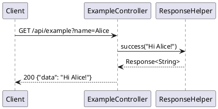

---

## 2. Demo Error Response

| | |
|---|---|
| **HTTP Method** | `GET` |
| **Path** | `/api/example/error` |
| **HTTP Headers** | Standard headers — see Shared Conventions |

**Request** — no body, no parameters.

**Response Body**

```json
{
  "response": {
    "code": "998",
    "description": "bad request",
    "time": "2026-07-12T10:00:00.000+07:00"
  },
  "error": {
    "violations": {
      "key": ["value"]
    }
  }
}
```

**List Response Code**

| Code | Description |
|---|---|
| `998` | Always returned — endpoint exists solely to demonstrate the error envelope shape |

**Sequence Flow**

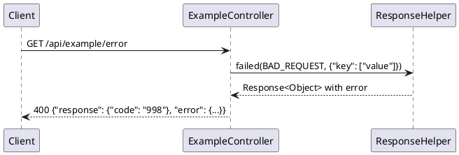

---

## 3. Purge Dead-Letter Records

| | |
|---|---|
| **HTTP Method** | `DELETE` |
| **Path** | `/internal-api/dead_letter_process` |
| **HTTP Headers** | Standard headers — see Shared Conventions |

**Request** — no request body.

| Parameter | Type | Required | Description |
|---|---|---|---|
| `days` | Integer | No | Age threshold in days. Records older than this are deleted. Defaults to `30`. |

**Response Body**

```json
{
  "response": {
    "code": "000",
    "description": "success",
    "time": "2026-07-12T10:00:00.000+07:00"
  },
  "data": true
}
```

Response is returned immediately. Deletion runs asynchronously after the response is sent (`doOnSuccess`).

**List Response Code**

| Code | Description |
|---|---|
| `000` | Accepted — deletion is running asynchronously |
| `900` | `days` failed constraint validation |
| `999` | Internal error |

**Sequence Flow**

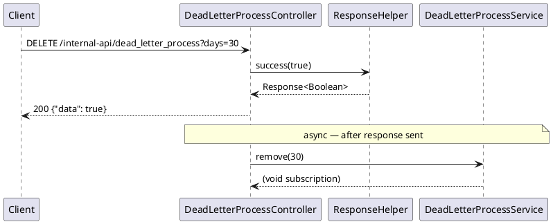

---

## 4. Retry Dead-Letter Records

| | |
|---|---|
| **HTTP Method** | `POST` |
| **Path** | `/internal-api/dead_letter_process/_retry` |
| **Content-Type** | `application/json` |
| **HTTP Headers** | Standard headers — see Shared Conventions |

**Request Body**

```json
{
  "processType": "TRANSACTION",
  "processName": "outgoing-rest-call",
  "size": 10
}
```

| Field | Type | Mandatory | Length | Description |
|---|---|---|---|---|
| `processType` | String | M | - | Process category (e.g. `TRANSACTION`). Must not be blank. |
| `processName` | String | M | - | Name of the process to retry. Must not be blank. |
| `size` | Integer | M | - | Maximum records to retry in this batch. Minimum value: `1`. |

**Response Body**

```json
{
  "response": {
    "code": "000",
    "description": "success",
    "time": "2026-07-12T10:00:00.000+07:00"
  },
  "data": true
}
```

Response is returned immediately. Retry runs asynchronously after the response is sent.

**List Response Code**

| Code | Description |
|---|---|
| `000` | Accepted — retry is running asynchronously |
| `900` | Validation failure on `processType`, `processName`, or `size` |
| `999` | Internal error |

**Sequence Flow**

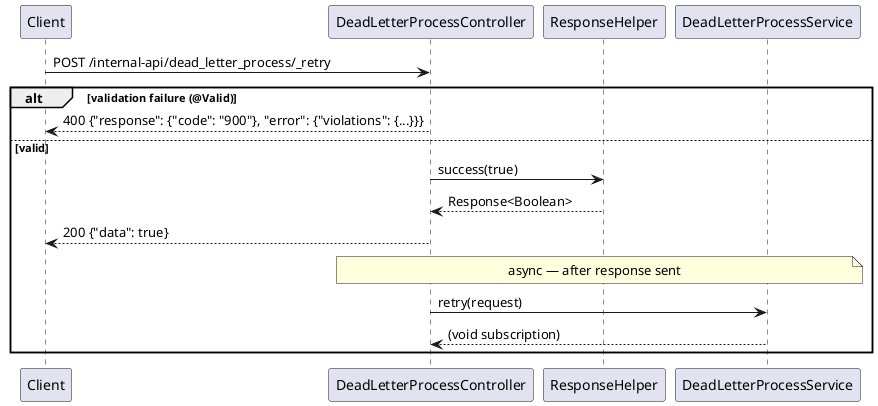

---

## 5. Purge Audit Log Records

| | |
|---|---|
| **HTTP Method** | `DELETE` |
| **Path** | `/internal-api/event_log` |
| **HTTP Headers** | Standard headers — see Shared Conventions |

**Request** — no request body.

| Parameter | Type | Required | Description |
|---|---|---|---|
| `days` | Integer | No | Age threshold in days. Records older than this are deleted. Defaults to `30`. |

**Response Body**

```json
{
  "response": {
    "code": "000",
    "description": "success",
    "time": "2026-07-12T10:00:00.000+07:00"
  },
  "data": true
}
```

Response is returned immediately. Deletion runs asynchronously.

**List Response Code**

| Code | Description |
|---|---|
| `000` | Accepted — deletion is running asynchronously |
| `999` | Internal error |

**Sequence Flow**

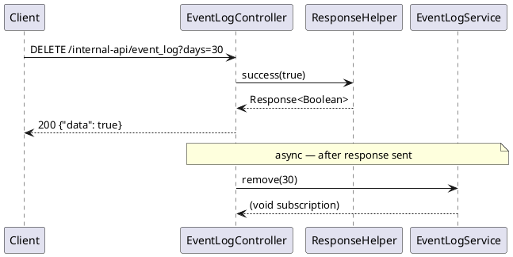

---

## 6. ISO8583 Sign-On

| | |
|---|---|
| **HTTP Method** | `GET` |
| **Path** | `/internal-api/network/sign-on` |
| **HTTP Headers** | Standard headers — see Shared Conventions |

**Request** — no body, no parameters.

**Response Body**

```json
{
  "response": {
    "code": "000",
    "description": "success",
    "time": "2026-07-12T10:00:00.000+07:00"
  },
  "data": true
}
```

Response is returned immediately. The 0800/logon message is dispatched asynchronously in `doOnSuccess`.

**List Response Code**

| Code | Description |
|---|---|
| `000` | Accepted — sign-on message dispatched |
| `999` | Internal error |

**Sequence Flow**


---

## 7. ISO8583 Sign-Off

| | |
|---|---|
| **HTTP Method** | `GET` |
| **Path** | `/internal-api/network/sign-off` |
| **HTTP Headers** | Standard headers — see Shared Conventions |

**Request** — no body, no parameters.

**Response Body**

```json
{
  "response": {
    "code": "000",
    "description": "success",
    "time": "2026-07-12T10:00:00.000+07:00"
  },
  "data": true
}
```

The 0800/logoff message is dispatched in `doOnNext` — concurrent with response delivery.

**List Response Code**

| Code | Description |
|---|---|
| `000` | Accepted — sign-off message dispatched |
| `999` | Internal error |

**Sequence Flow**

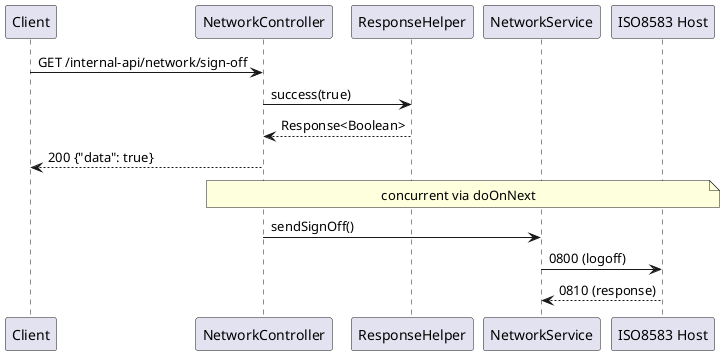

---

## 8. ISO8583 Echo / Health Check

| | |
|---|---|
| **HTTP Method** | `GET` |
| **Path** | `/internal-api/network/echo` |
| **HTTP Headers** | Standard headers — see Shared Conventions |

**Request** — no body, no parameters.

**Response Body**

```json
{
  "response": {
    "code": "000",
    "description": "success",
    "time": "2026-07-12T10:00:00.000+07:00"
  },
  "data": true
}
```

`data` reflects the actual boolean result from `NetworkService.sendEcho()` — unlike sign-on/off, this is synchronous in the reactive chain.

**List Response Code**

| Code | Description |
|---|---|
| `000` | Echo succeeded — channel is healthy |
| `999` | Echo failed or internal error |

**Sequence Flow**

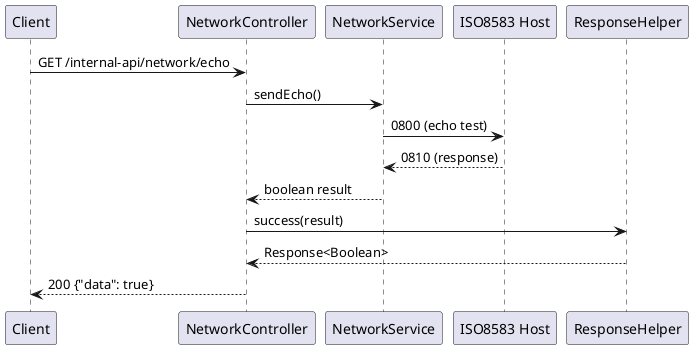

---

## 9. Reload Configuration Group

| | |
|---|---|
| **HTTP Method** | `PUT` |
| **Path** | `/internal-api/configurations/_reload` |
| **HTTP Headers** | Standard headers — see Shared Conventions |

**Request** — no request body.

| Parameter | Type | Required | Description |
|---|---|---|---|
| `group` | PropertiesGroup | Yes | Enum value identifying which group to reload from the database. See Shared Conventions for valid values. |

**Response Body**

```json
{
  "response": {
    "code": "000",
    "description": "success",
    "time": "2026-07-12T10:00:00.000+07:00"
  },
  "data": true
}
```

Response is returned immediately. The database re-fetch and in-memory cache update run asynchronously in `doOnSuccess`.

**List Response Code**

| Code | Description |
|---|---|
| `000` | Accepted — cache reload dispatched |
| `900` | `group` is not a valid `PropertiesGroup` enum value |
| `999` | Internal error |

**Sequence Flow**

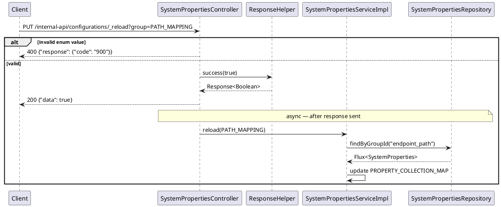

---

## 10. Read Configuration Group

| | |
|---|---|
| **HTTP Method** | `GET` |
| **Path** | `/internal-api/configurations` |
| **HTTP Headers** | Standard headers — see Shared Conventions |

**Request** — no request body.

| Parameter | Type | Required | Description |
|---|---|---|---|
| `key` | PropertiesGroup | Yes | Enum value identifying which in-memory group to read. See Shared Conventions for valid values. |

**Response Body**

```json
{
  "response": {
    "code": "000",
    "description": "success",
    "time": "2026-07-12T10:00:00.000+07:00"
  },
  "data": {
    "10.97-E001": "/api/transaction"
  }
}
```

`data` is the `Map<String, String>` held in the in-memory cache for the requested group. Returns an empty map if the group has not been loaded yet.

**List Response Code**

| Code | Description |
|---|---|
| `000` | Success — in-memory map returned |
| `900` | `key` is not a valid `PropertiesGroup` enum value |
| `999` | Internal error |

**Sequence Flow**

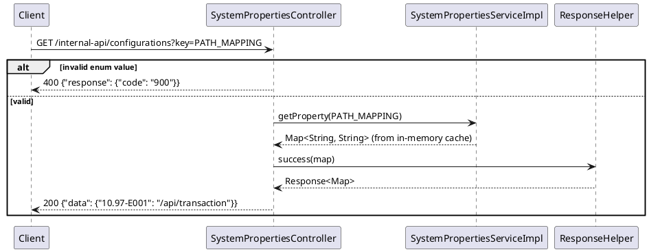

---

## 11. Reload JSLT Templates for a Selector

| | |
|---|---|
| **HTTP Method** | `POST` |
| **Path** | `/internal-api/jslt/_reload` |
| **HTTP Headers** | Standard headers — see Shared Conventions |

**Request** — no request body.

| Parameter | Type | Required | Description |
|---|---|---|---|
| `selector` | String | Yes | Transaction selector key (e.g. `10.97-E001`). Both `client_spec_request` and `client_spec_response` compiled expressions for this selector are evicted, re-fetched, and recompiled. |

**Response Body**

```json
{
  "response": {
    "code": "000",
    "description": "success",
    "time": "2026-07-12T10:00:00.000+07:00"
  },
  "data": {
    "client_spec_request": "{\"amount\": .amount, \"currency\": .currency}",
    "client_spec_response": "{\"response\": {\"code\": .responseCode}}"
  }
}
```

If no template exists in the database for a direction, that key's value is an empty string `""`.

**List Response Code**

| Code | Description |
|---|---|
| `000` | Success — cache evicted and rewarmed |
| `900` | `selector` missing or blank |
| `999` | Template compile error (malformed JSLT) or internal error |

**Sequence Flow**

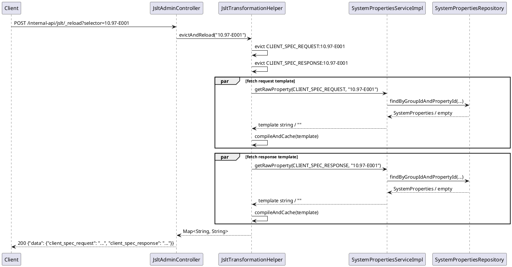

---

## 12. Get JSLT Template Text for a Selector

| | |
|---|---|
| **HTTP Method** | `GET` |
| **Path** | `/internal-api/jslt/templates` |
| **HTTP Headers** | Standard headers — see Shared Conventions |

**Request** — no request body.

| Parameter | Type | Required | Description |
|---|---|---|---|
| `selector` | String | Yes | Transaction selector key. Fetches raw template text from the database for both directions without recompiling. |

**Response Body**

```json
{
  "response": {
    "code": "000",
    "description": "success",
    "time": "2026-07-12T10:00:00.000+07:00"
  },
  "data": {
    "client_spec_request": "{\"amount\": .amount, \"currency\": .currency}",
    "client_spec_response": "{\"response\": {\"code\": .responseCode}}"
  }
}
```

If no template exists for a direction, the value is `""`.

**List Response Code**

| Code | Description |
|---|---|
| `000` | Success — template texts returned |
| `900` | `selector` missing or blank |
| `999` | Internal error |

**Sequence Flow**

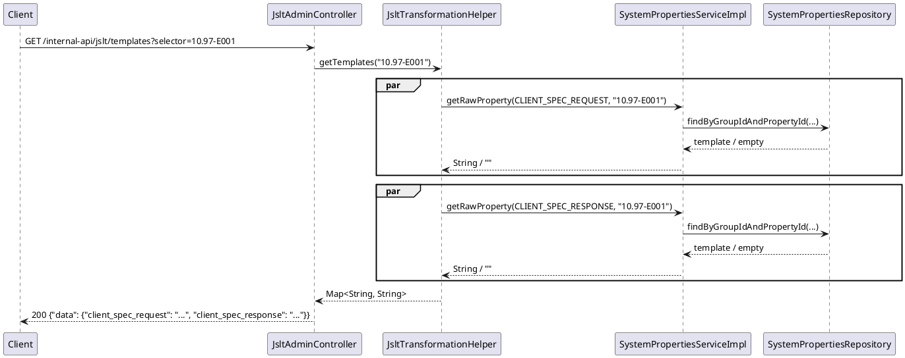

---

## 13. Reload All JSLT Templates

| | |
|---|---|
| **HTTP Method** | `POST` |
| **Path** | `/internal-api/jslt/_reload-all` |
| **HTTP Headers** | Standard headers — see Shared Conventions |

**Request** — no body, no parameters.

**Response Body**

```json
{
  "response": {
    "code": "000",
    "description": "success",
    "time": "2026-07-12T10:00:00.000+07:00"
  },
  "data": true
}
```

Clears the entire compiled expression cache, re-fetches all rows from both `client_spec_request` and `client_spec_response` groups, and recompiles every template before returning.

**List Response Code**

| Code | Description |
|---|---|
| `000` | Success — entire cache cleared and rewarmed |
| `999` | Template compile error (malformed JSLT row) or internal error |

**Sequence Flow**

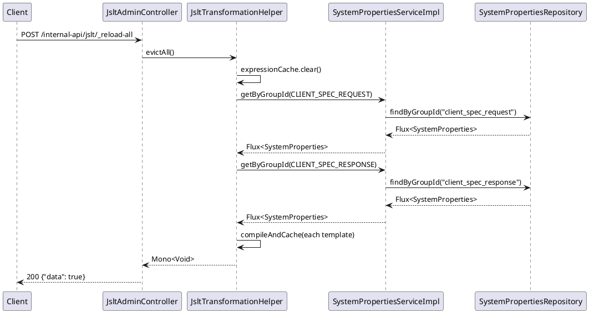

---

## 14. Create or Update JSLT Template

| | |
|---|---|
| **HTTP Method** | `PUT` |
| **Path** | `/internal-api/jslt/template` |
| **Content-Type** | `text/plain` |
| **HTTP Headers** | Standard headers — see Shared Conventions |

**Request** — plain text body (raw JSLT expression string).

| Parameter | Type | Required | Description |
|---|---|---|---|
| `selector` | String | Yes | Transaction selector key (e.g. `10.97-E001`). Becomes `property_id` in `system_properties`. |
| `group` | PropertiesGroup | Yes | Direction: `CLIENT_SPEC_REQUEST` to shape the outgoing REST body, `CLIENT_SPEC_RESPONSE` to normalise the REST reply. |

Request body (raw, `text/plain`):
```
{"amount": .amount, "currency": .currency, "pan": .cardNo}
```

**Response Body**

```json
{
  "response": {
    "code": "000",
    "description": "success",
    "time": "2026-07-12T10:00:00.000+07:00"
  },
  "data": {
    "id": 42,
    "groupId": "client_spec_request",
    "propertyId": "10.97-E001",
    "propertyValue": "{\"amount\": .amount, \"currency\": .currency, \"pan\": .cardNo}"
  }
}
```

| Field | Type | Description |
|---|---|---|
| `data.id` | Long | Auto-assigned database row ID |
| `data.groupId` | String | Resolved group string (e.g. `client_spec_request`) |
| `data.propertyId` | String | Echoed `selector` value |
| `data.propertyValue` | String | Echoed template text as stored |

After save, the compiled expression for `group:selector` is evicted from the cache. The next transform call recompiles from the new value.

**List Response Code**

| Code | Description |
|---|---|
| `000` | Success — row created or updated, compiled expression cache evicted |
| `900` | `selector` or `group` missing / invalid enum value |
| `999` | Database error or internal error |

**Sequence Flow**

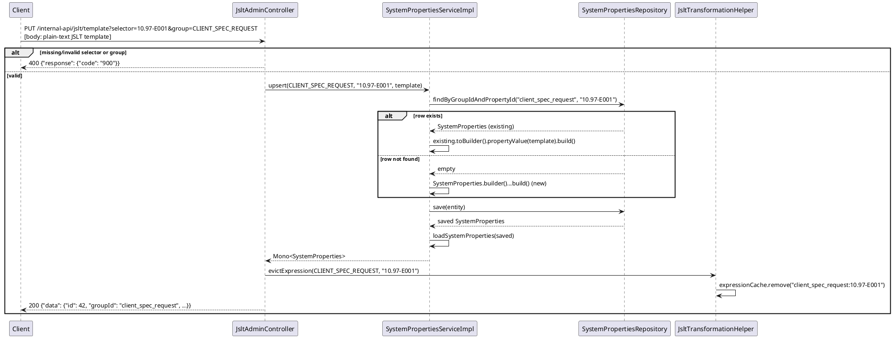
